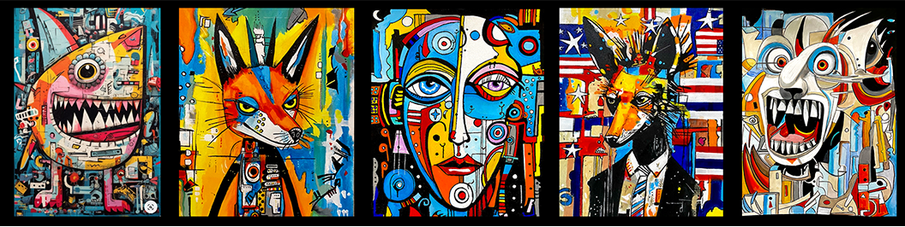
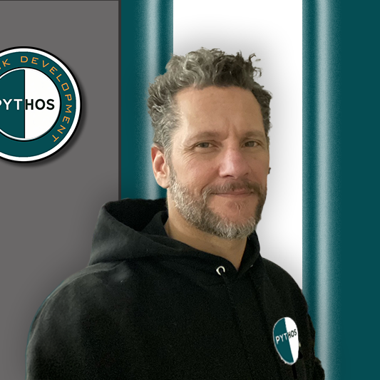

# Fotios Mpouris Portfolio Website

Welcome to the repository for my personal portfolio website, **[fotiosmpouris.com](https://fotiosmpouris.com)**—a dynamic showcase of my skills as a full-stack developer, multimedia specialist, and technical artist. This project blends cutting-edge web design with a passion for AI innovation, creative multimedia, and community-driven solutions like **Pythos**. Built with HTML, CSS, and JavaScript, this site is a testament to my commitment to merging artistry with technology.

*“People Are The Solution”* — This mantra drives my work, and this website is where it all comes together.

---

## 🌟 Overview

This portfolio serves as a central hub to explore my professional journey, projects, and vision. Whether you're here to collaborate, hire me, or join the **Pythos** movement, you'll find a mix of technical prowess and creative flair.

### Key Pages
- **Home (`index.html`)**: A bold introduction with a hero banner and calls-to-action.
- **About (`about.html`)**: My story, skills, and professional experience as a technical artist.  
  
- **AI Apps (`ai-apps.html`)**: Showcasing my AI-powered projects like *Siding Assistant* and *Oriana*.
- **Websites (`websites.html`)**: A gallery of web designs, from *ColorFotiFoti* to *The Grillin Greek*.
- **Multimedia (`multimedia.html`)**: Motion graphics and branding samples.
- **Unity Projects (`unity-projects.html`)**: Game development prototypes built in Unity.
- **Pythos (`pythos.html`)**: My flagship initiative—a tokenized revolution for financial empowerment.  
  

---

## 🎨 Features

- **Responsive Design** 📱: Seamless experience across mobile, tablet, and desktop with a hamburger menu for mobile navigation.
- **Dark/Light Mode** ☀️🌙: Toggle between themes with a sleek sun button (persisted via localStorage).
- **Fade-In Animations** ✨: Smooth scroll-triggered transitions for an engaging user experience.
- **Interactive Elements** 🖱️: Video playback with mute toggles, smooth scrolling, and hover effects.
- **Pythos Integration** 💰: Volunteer forms, progress bars, and contribution options for my flagship project.
- **Multimedia Showcase** 🎥: Embedded videos and placeholders for animations to highlight my creative work.

---

## 🛠️ Tech Stack

- **HTML5** 📝: Semantic markup for accessibility and structure.
- **CSS3** 🎨: Custom styles with variables, transitions, and media queries (`style.css`).
- **JavaScript** ⚙️: Dynamic functionality like dark mode, hamburger menu, and scroll animations (`script.js`).
- **Assets** 🖼️: Images (`images/`), videos (`videos/`), and more for a rich visual experience.

---

